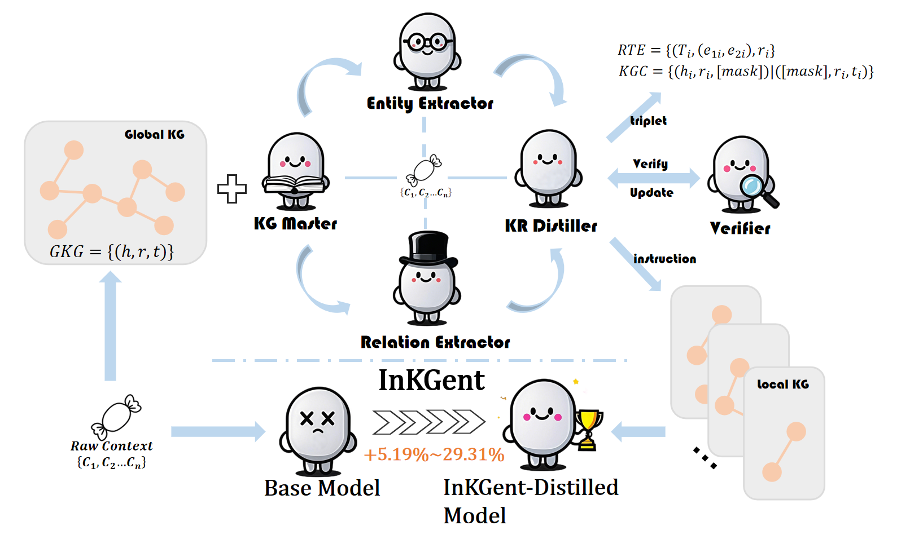

# KG-MAD:Knowledge Graph-guided Multi-agent Distillation

This repository contains the source code for **'KG-MAD:Knowledge Graph-guided Multi-agent Distillation'**, a cutting-edge framework designed to enhance industrial decision-making through multi-agent systems distillation and local knowledge graphs.



---

## Project Introduction

In the industrial domain, the efficient execution of complex decision-making tasks is crucial for enhancing productivity, optimizing resource allocation, and addressing emergency events. However, existing methods often struggle with efficiency, model generalization, and resource limitations when handling large-scale, dynamically changing industrial data. To address these challenges, this project proposes a novel framework based on Multi-Agent Systems (MAS) and knowledge distillation, combined with heterogeneous local knowledge graphs, to enhance the efficiency and accuracy of industrial decision-making.

### Key Features

- **Multi-Agent Systems (MAS)**: Generate heterogeneous local knowledge graphs from a global knowledge graph to meet diverse information needs in complex industrial tasks.
- **Knowledge Distillation**: Transfer the powerful analytical capabilities of Large Language Models (LLM) into resource-constrained industrial environments, optimizing model performance and decision support.
- **Industrial Dataset**: Provides a rich domain-specific dataset for model training and validation, covering decision-making and emergency response scenarios.
- **Evaluation Metrics**: Comprehensive evaluation of knowledge graph accuracy and consistency, with detailed metrics and results.

---

## Running Environment

- **Python**: 3.8+
- **Dependencies**:
  - OpenAI
  - GraphRAG
  - llama-factory
  - Swarm
---

## Installation

### Install Dependencies

Ensure you have Python 3.8 or higher installed. Run the following command to install project dependencies:

```bash
pip install -r requirements.txt
```
### Configure OpenAI API

Configure your OpenAI API key and base URL in the config.py file:

```bash
OPENAI_API_KEY = "YOUR_API_KEY_HERE"  # Replace with your OpenAI API key
OPENAI_BASE_URL = "BASE_URL"  # Replace with your OpenAI API base URL
```
### Initialize Knowledge Graph

If there is no pre-existing knowledge graph in the project, you need to initialize it by running the following commands:

```bash
python -m graphrag.index --init --root ./test
python -m graphrag.index --root ./test
```
---

## Usage

### Data Preparation

Prepare your input data in an Excel file, with the file name and path configured in config.py (default is test_data.xlsx). Ensure the file contains a column named context that stores the text data to be processed.

### Run the Main Program

Run the main script to process the input data and generate knowledge graph triples, questions, and answers:

```bash
python main.py
```

### Evaluate the Generated Knowledge Graph

Run the evaluation script to assess the accuracy and consistency of the generated knowledge graph:

```bash
python eval.py
```
Evaluation results will be saved as JSON files (kgc_results.json and rte_results.json), and metrics such as accuracy and confidence scores will be printed.

### Output Files

- output/output_t.xlsx: Contains processed knowledge graph triples, questions, and answers.
- output/rte_output_t.json: Contains the results of Relation Extraction (RTE).
- output/kgc_output_t.json: Contains the results of Knowledge Graph Construction (KGC).
- kgc_results.json and rte_results.json: Evaluation result files.

---

## Notes

- Fine-tuning and evaluation of the distilled models follow the usage guidelines from llama-factory.
- Ensure the format of the input data is correct, especially the content of the context column.
- If you encounter errors during execution, check the log messages to identify the issue.
- The evaluation script requires access to the OpenAI API. Ensure your network connection is stable and the API configuration is correct.

---

## Contribution

Contributions are welcome! Feel free to submit Pull Requests or Issues via GitHub
